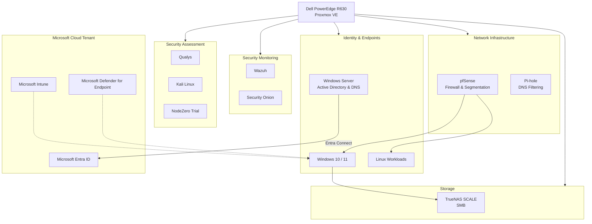
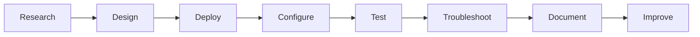

# Enterprise Security Home Lab

**Infrastructure Engineering | Cloud Security | Hybrid Identity | Network Security | Security Operations**

Welcome to my Enterprise Security Home Lab — a personally designed, implemented, and maintained technical environment built to explore enterprise infrastructure, cybersecurity, Microsoft cloud technologies, and security architecture.

This environment runs primarily on a **Dell PowerEdge R630 using Proxmox VE** and includes virtualized Windows and Linux workloads, network security appliances, identity services, security monitoring platforms, and vulnerability assessment tools.

The lab also integrates with my personally managed Microsoft cloud tenant, allowing me to evaluate hybrid identity, endpoint management, and Microsoft security technologies.

This repository documents the hands-on engineering behind the environment, including architecture decisions, deployment processes, configuration considerations, troubleshooting, validation, and lessons learned.

> **Engineering philosophy:** Go beyond getting a technology working. Understand how it operates, how it integrates with other systems, how to secure it, and how to troubleshoot it when something fails.

---

## Architecture Overview

The environment brings together multiple infrastructure and security disciplines into a single interconnected lab.

This is a logical architecture diagram. Detailed infrastructure and security relationships are documented separately.

**[View Full Architecture Documentation](architecture/README.md)**

---

## Technology Stack

| Category | Technologies |
|---|---|
| Virtualization | Proxmox VE, KVM, Open vSwitch |
| Operating Systems | Windows Server, Windows 10/11, Ubuntu, Kali Linux |
| Networking | pfSense, VLANs, Firewall Rules, DNS |
| Identity | Active Directory DS, Microsoft Entra ID, Entra Connect |
| Endpoint Security | Microsoft Defender for Endpoint, Microsoft Intune, Group Policy |
| Security Monitoring | Wazuh, Security Onion |
| Vulnerability Management | Qualys, Horizon3.ai NodeZero (Trial) |
| Security Testing | Kali Linux, T-Pot |
| Storage | TrueNAS SCALE, ZFS, SMB |
| Network Services | Pi-hole |
| Cloud | Microsoft Azure and Microsoft 365 Security Ecosystem |

The technologies listed reflect platforms used or evaluated in the lab. Individual documents describe their implementation scope and distinguish deployed controls from planned improvements.

---

## Engineering Projects and Documentation

### 1. Infrastructure and Virtualization

**[Proxmox VE Infrastructure](proxmox/README.md)**

Deployment and management of virtualized Windows and Linux workloads on a Dell PowerEdge R630.

Topics include:

- Virtual machine provisioning
- Virtual networking
- Windows 11 virtual TPM and VirtIO configuration
- Linux deployment
- VM migrations using OVA, VMDK, and QCOW2
- Infrastructure troubleshooting

Additional documentation:

- [Virtual Machine Deployment](proxmox/vm-deployment.md)
- [Virtual Machine Migration](proxmox/vm-migration.md)

### 2. Network Security and Segmentation

**[Network Security Architecture](network-security/README.md)**

Implementation and evaluation of network security boundaries using pfSense and Proxmox networking.

Topics include:

- Firewall policies
- Network segmentation
- VLAN isolation
- Controlled security-testing environments
- Network connectivity validation
- Security considerations

Additional documentation:

- [pfSense Segmentation](network-security/pfsense-segmentation.md)

### 3. Identity and Microsoft Security

**[Identity Architecture](identity/README.md)**

A Windows Server Active Directory environment integrated with a personally managed Microsoft cloud tenant.

Topics include:

- Active Directory Domain Services
- Group Policy
- Microsoft Entra Connect
- Hybrid identity
- Microsoft Intune
- Microsoft Defender for Endpoint
- Endpoint onboarding
- USB Device Control testing

Additional documentation:

- [Active Directory](identity/active-directory.md)
- [Microsoft Entra Connect](identity/entra-connect.md)
- [Hybrid Identity](identity/hybrid-identity.md)
- [Microsoft Defender for Endpoint](identity/defender-for-endpoint.md)

### 4. Security Monitoring and Detection

**[Security Monitoring Architecture](security-monitoring/README.md)**

Evaluation of host-based and network-based security monitoring technologies.

Topics include:

- Wazuh endpoint monitoring
- Security Onion network monitoring
- Open vSwitch traffic mirroring
- Security telemetry
- Detection validation
- Troubleshooting

Additional documentation:

- [Wazuh](security-monitoring/wazuh.md)
- [Security Onion](security-monitoring/security-onion.md)

### 5. Vulnerability Management and Security Assessment

**[Vulnerability Management Architecture](vulnerability-management/README.md)**

Hands-on vulnerability assessment and authorized security testing within an isolated lab.

Topics include:

- Qualys vulnerability scanning
- Vulnerability identification
- Risk-based prioritization
- Horizon3.ai NodeZero trial evaluation
- Attack-path validation
- Remediation and retesting

Additional documentation:

- [Qualys](vulnerability-management/qualys.md)
- [NodeZero](vulnerability-management/nodezero.md)

### 6. Storage Infrastructure

**[Storage Architecture](storage/README.md)**

TrueNAS SCALE deployment within Proxmox for centralized network storage.

Topics include:

- ZFS architecture
- SMB file sharing
- Windows client connectivity
- Authentication and permissions
- Storage security
- Troubleshooting and recovery considerations

Additional documentation:

- [TrueNAS SCALE and SMB](storage/truenas-smb.md)

### 7. Network Services

**[Network Services Architecture](network-services/README.md)**

DNS services and filtering within the lab environment.

Topics include:

- Pi-hole DNS filtering
- DNS resolution
- pfSense integration considerations
- Active Directory DNS
- DNS troubleshooting
- Network security and DNS bypass considerations

Additional documentation:

- [Pi-hole](network-services/pihole.md)

---

## Hands-On Engineering Approach

Every major technology in this repository represents an opportunity to develop practical engineering skills through deployment, configuration, troubleshooting, and testing.

My approach follows a repeatable process:

The emphasis is on understanding how systems behave, not simply completing an installation.

### Key Areas of Focus

**Infrastructure Engineering**

Building and maintaining virtualized infrastructure, networking, storage, and operating-system services.

**Cloud and Hybrid Identity**

Understanding how on-premises identity integrates with Microsoft Entra ID and cloud-based management services.

**Security Architecture**

Evaluating layered controls across identity, endpoints, networking, monitoring, and infrastructure.

**Security Validation**

Testing whether configurations produce the intended behavior and documenting findings.

**Troubleshooting**

Investigating issues systematically across network, operating-system, application, and security layers.

---

## Security Architecture Principles

The lab is guided by several principles:

- **Defense in Depth:** Use complementary security controls rather than relying on one technology.
- **Least Privilege:** Restrict access according to operational requirements.
- **Network Segmentation:** Separate trusted infrastructure from controlled security-testing workloads.
- **Identity Security:** Treat authentication, authorization, and privileged access as foundational controls.
- **Visibility:** Use endpoint and network monitoring to understand system behavior.
- **Validation:** Verify that security controls work as intended.
- **Continuous Improvement:** Review configurations, troubleshoot issues, and refine the architecture.

---

## Current Areas of Development

This is an ongoing engineering environment rather than a completed one-time project.

Areas of continued development include:

- Advanced Microsoft Entra security configurations
- Microsoft Defender and Intune policy testing
- Security detection engineering
- Security monitoring improvements
- Infrastructure automation
- Advanced network security
- Vulnerability remediation workflows
- Storage recovery and resilience
- Microsoft Azure security architecture
- Zero Trust architecture principles

New documentation will be added as additional capabilities are implemented and validated.

---

## About This Project

I work professionally in systems engineering, cloud infrastructure, and Microsoft security technologies.

I built this environment to strengthen my practical understanding of infrastructure and cybersecurity, evaluate technologies independently, and explore how different systems integrate within an enterprise-style architecture.

My longer-term focus is on **Cloud Security Architecture, Microsoft Azure, Hybrid Identity, and Enterprise Security Engineering**.

This repository serves as a living technical portfolio of my hands-on work, engineering decisions, troubleshooting experience, and continued professional development.

---

## Repository Navigation

| Section | Documentation |
|---|---|
| Architecture | [View](architecture/README.md) |
| Proxmox | [View](proxmox/README.md) |
| Network Security | [View](network-security/README.md) |
| Identity | [View](identity/README.md) |
| Security Monitoring | [View](security-monitoring/README.md) |
| Vulnerability Management | [View](vulnerability-management/README.md) |
| Storage | [View](storage/README.md) |
| Network Services | [View](network-services/README.md) |

---

**Built, configured, tested, and maintained through hands-on engineering. Documented to share knowledge and demonstrate continuous technical development.**
