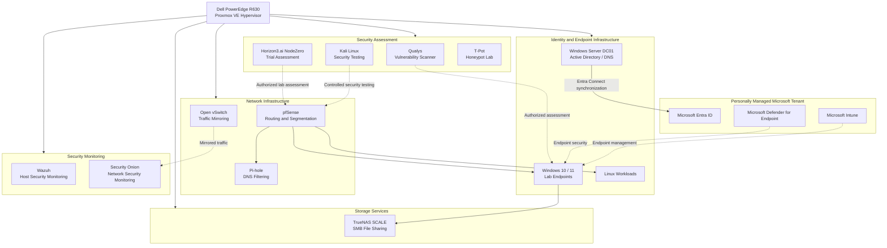
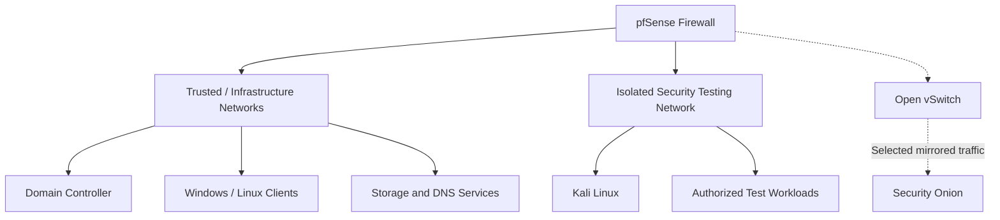
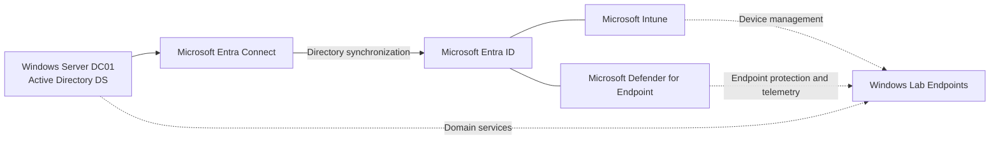
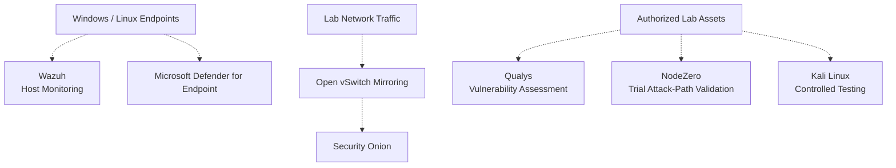
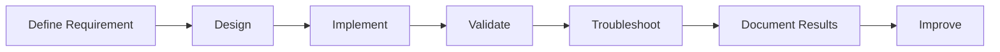

# Enterprise Security Home Lab — Architecture

## Overview

This document provides a high-level architectural view of my Enterprise Security Home Lab, built on a Dell PowerEdge R630 running Proxmox VE.

The environment is designed to simulate enterprise infrastructure and security operations, with emphasis on:

- Infrastructure virtualization and workload management
- Network segmentation and firewall policy
- Windows Server and Active Directory Domain Services
- Hybrid identity integration with Microsoft Entra ID
- Endpoint management and Microsoft Defender for Endpoint
- Network and endpoint security monitoring
- Vulnerability assessment and security validation
- Centralized storage and DNS filtering

The architecture supports hands-on infrastructure engineering, security-control testing, troubleshooting, and evaluation of Microsoft cloud security capabilities.

---

## 1. High-Level Architecture

### Architecture Notes

The diagram represents the major infrastructure and security components and their logical relationships.

It is not intended to disclose exact VLAN IDs, IP addresses, routing tables, physical cabling, or management endpoints.

Dashed connections represent logical monitoring, management, or assessment relationships rather than a guarantee of direct network connectivity.

---

## 2. Network Segmentation Architecture

pfSense provides firewall enforcement and routing between applicable lab networks.

Open vSwitch is used to mirror selected network traffic to Security Onion for passive analysis.

### Design Principles

- Separate security-testing activity from infrastructure management.
- Apply firewall rules to restrict unnecessary inter-network communication.
- Allow only explicitly required connectivity.
- Use passive traffic monitoring where appropriate.
- Validate segmentation using controlled connectivity tests.

Network diagrams represent logical security boundaries; actual enforcement depends on interface assignments, routing, VLAN configuration, and firewall rules.

---

## 3. Hybrid Identity Architecture

The lab includes an on-premises Active Directory environment integrated with a personally managed Microsoft tenant.

### Key Architecture Considerations

- Active Directory remains the source of authority for applicable synchronized identities.
- Entra Connect provides synchronization between the on-premises directory and Microsoft Entra ID.
- Intune and Microsoft Defender for Endpoint perform different endpoint management and security functions.
- Device enrollment, identity synchronization, and MDE onboarding must be validated independently.
- Security controls should be tested using controlled lab scenarios.

---

## 4. Security Monitoring and Assessment Architecture

The environment incorporates complementary security technologies.

These platforms address different security functions:

| Technology | Primary function |
|---|---|
| Wazuh | Host-based security monitoring |
| Security Onion | Network security monitoring |
| Microsoft Defender for Endpoint | Endpoint protection, detection, and investigation |
| Qualys | Vulnerability assessment |
| NodeZero | Autonomous security assessment and attack-path validation |
| Kali Linux | Controlled security testing |

The presence of multiple tools does not imply that they are directly integrated or that every lab endpoint is monitored by every platform.

---

## 5. Infrastructure Inventory

The following inventory summarizes known virtualized workloads and services.

| VM ID | Workload | Primary purpose |
|---|---|---|
| 100 | Windows 11 | Windows endpoint testing |
| 101 | Wazuh | Security monitoring |
| 102 | Security workload | Security lab services |
| 103 | Kali Linux | Controlled security testing |
| 104 | pfSense | Firewall and segmentation |
| 105 | Windows 10 | Windows endpoint testing |
| 106 | TrueNAS SCALE | Network-attached storage |
| 107 | Windows 11 test workload | Isolated endpoint testing |
| 108 | Ubuntu | Linux infrastructure |
| 109 | DC01 | Active Directory Domain Services |
| 200 | Qualys Scanner | Vulnerability assessment |
| 300 | Ubuntu VM | Linux testing |

VM identifiers are included for architectural reference. Workload roles, assignments, and configurations may evolve.

Other services, including Pi-hole, Security Onion, and T-Pot, are documented at the service level where their current VM placement is not specified.

---

## 6. Architecture Design Principles

### Defense in Depth

The environment combines identity, endpoint, network, monitoring, and assessment controls.

### Least Privilege

Access to infrastructure and data should be limited according to operational requirements.

### Segmentation

Security-testing networks should remain separated from trusted infrastructure except where explicitly permitted.

### Visibility

Host telemetry and network traffic provide complementary information for detection and investigation.

### Independent Validation

Configuration does not automatically prove enforcement. Controls should be validated through repeatable tests.

### Operational Resilience

Storage, DNS, identity, and networking are foundational dependencies that require availability and recovery planning.

### Documentation and Repeatability

Engineering decisions, validation procedures, troubleshooting findings, and future improvements should be documented.

---

## 7. Validation Approach

Security and infrastructure changes follow a repeatable engineering process:

Validation may include:

- Network connectivity and firewall enforcement tests
- Active Directory authentication and DNS resolution
- Microsoft Entra Connect synchronization checks
- Endpoint onboarding verification
- USB Device Control enforcement testing
- Vulnerability assessment and remediation verification
- SMB authentication and permissions testing
- DNS filtering validation
- Security telemetry inspection

A control is considered validated only when its intended behavior has been observed and the test outcome recorded.

---

## 8. Related Documentation

### Infrastructure

- [Proxmox VE Infrastructure](../proxmox/README.md)
- [Virtual Machine Deployment](../proxmox/vm-deployment.md)
- [Virtual Machine Migration](../proxmox/vm-migration.md)

### Network Security

- [Network Security Architecture](../network-security/README.md)
- [pfSense Segmentation](../network-security/pfsense-segmentation.md)

### Identity and Endpoint Security

- [Identity Architecture](../identity/README.md)
- [Active Directory](../identity/active-directory.md)
- [Microsoft Entra Connect](../identity/entra-connect.md)
- [Hybrid Identity](../identity/hybrid-identity.md)
- [Microsoft Defender for Endpoint](../identity/defender-for-endpoint.md)

### Security Monitoring

- [Security Monitoring Architecture](../security-monitoring/README.md)
- [Wazuh](../security-monitoring/wazuh.md)
- [Security Onion](../security-monitoring/security-onion.md)

### Security Assessment

- [Vulnerability Management](../vulnerability-management/README.md)
- [Qualys](../vulnerability-management/qualys.md)
- [Horizon3.ai NodeZero](../vulnerability-management/nodezero.md)

### Storage and Network Services

- [Storage Architecture](../storage/README.md)
- [TrueNAS SCALE and SMB](../storage/truenas-smb.md)
- [Network Services](../network-services/README.md)
- [Pi-hole DNS Filtering](../network-services/pihole.md)

---

## 9. Future Architecture Improvements

Planned areas of continued development include:

- Additional architecture diagrams showing validated network boundaries
- Centralized security monitoring workflows
- Security alert correlation
- Automated security response
- Advanced Microsoft Defender configurations
- Expanded Microsoft Entra security controls
- Infrastructure configuration automation
- Storage recovery validation
- DNS resilience
- Additional vulnerability remediation testing
- Infrastructure-as-Code evaluation

Improvements will be documented as they are implemented and tested.
